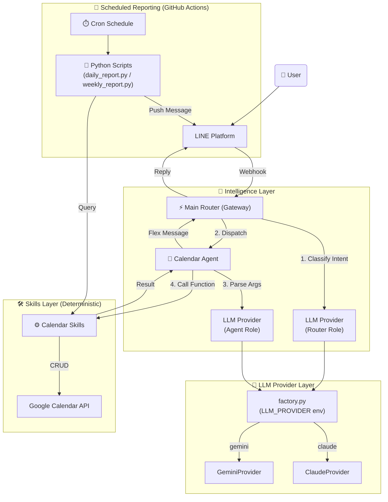

# 🤖 AI Butler - Personal Smart Assistant (Python Ver.)

A **Serverless** LINE AI Bot built with Python, supporting multiple AI model providers (**Google Gemini** and **Anthropic Claude**) that can be switched with a single environment variable.

This project adopts the **Router-Agent-Skill** architecture pattern, separating "Intent Classification", "Parameter Parsing", and "Execution Logic" to achieve high stability and scalability.

## ✨ Core Features

- **Ultra-Fast Intent Routing**: Uses lightweight models (Flash/Haiku) for sub-0.5s latency routing.
- **🔌 Swappable AI Provider**: Switch between Gemini and Claude via `LLM_PROVIDER` with zero code changes.
- **Atomic Skills**: Business logic is encapsulated in pure Python functions, ensuring 100% execution accuracy (no dependency on AI-generated code).
- **Natural Language Calendar Management**:
  - **Create**: "Dinner with Sam tomorrow at 7 PM."
  - **Query**: "What's on my schedule next week?"
  - **Smart Reschedule**: "Delay tomorrow's meeting by 1 hour." (Auto-executes: Search -> Delete Old -> Create New).
  - **Fuzzy Delete**: "Cancel the gym session tonight."
  - **Batch Create**: "Meeting every Wednesday at 10 AM." (Auto-expands to specific dates for the next 4 weeks).
- **🔔 Automated Reports**:
  - **Daily Report**: Sent at **21:00** every night, summarizing tomorrow's schedule.
  - **Weekly Report**: Sent every **Sunday**, summarizing the next 7 days.
  - Powered by **GitHub Actions** (Serverless Cron Jobs).
- **👥 Group Chat Support**: Works in group chats! Wake it up using the trigger word **"Butler"** or **"管家"** (e.g., "Butler, check my schedule").
- **Robustness**: Built-in argument normalization layer to automatically fix AI hallucinations.
- **Serverless**: Deployed on Google Cloud Functions (Gen 2). Pay-as-you-go.

## 🛠️ Tech Stack

- **Language**: Python 3.11
- **Cloud**: Google Cloud Platform (Cloud Functions Gen 2, Cloud Run)
- **AI Providers**: Google Gemini 3.0 Flash / Anthropic Claude (switchable)
- **Messaging**: LINE Messaging API (SDK v3)
- **CI/CD**: GitHub Actions (for Scheduled Cron Jobs)
- **Pattern**: Router-Agent-Skill Architecture

## 🏗️ Architecture


```mermaid
graph TD
    User("👤 User") --> Line["LINE Platform"]
    Line --Webhook--> Gateway["⚡ Main Router (Gateway)"]

    subgraph "🧠 Intelligence Layer"
        Gateway --"1. Classify Intent"--> RouterLLM["LLM Provider\n(Router Role)"]
        Gateway --"2. Dispatch"--> CalAgent["📅 Calendar Agent"]
        CalAgent --"3. Parse Args"--> AgentLLM["LLM Provider\n(Agent Role)"]
    end

    subgraph "🔌 LLM Provider Layer"
        RouterLLM & AgentLLM --> Factory["factory.py\n(LLM_PROVIDER env)"]
        Factory -->|gemini| Gemini["GeminiProvider"]
        Factory -->|claude| Claude["ClaudeProvider"]
    end

    subgraph "🛠️ Skills Layer (Deterministic)"
        CalAgent --"4. Call Function"--> Skill["⚙️ Calendar Skills"]
        Skill --"CRUD"--> GCal["Google Calendar API"]
    end

    subgraph "🔔 Scheduled Reporting (GitHub Actions)"
        Cron["⏱️ Cron Schedule"] --> Scripts["🐍 Python Scripts\n(daily_report.py / weekly_report.py)"]
        Scripts --"Query"--> Skill
        Scripts --"Push Message"--> Line
    end

    Skill --"Result"--> CalAgent
    CalAgent --"Flex Message"--> Gateway
    Gateway --"Reply"--> Line
```

## 📂 Project Structure

```text
.
├── main.py                     # Gateway (Router) - Only responsible for intent classification
├── .github/
│   └── workflows/              # GitHub Actions
│       ├── daily_notify.yml    # Daily Schedule Cron
│       └── weekly_notify.yml   # Weekly Schedule Cron
├── src/
│   ├── agents/                 # Agents (AI Parsers & Controllers)
│   │   ├── calendar.py
│   │   └── expense.py
│   ├── skills/                 # Skills (Pure Python Logic)
│   │   ├── calendar_skill.py
│   │   └── expense.py
│   ├── scripts/                # Standalone Scripts for Reports
│   │   ├── daily_report.py
│   │   └── weekly_report.py
│   ├── services/               # Drivers & Adapters
│   │   ├── gcal_service.py     # Google Calendar API integration
│   │   └── llm/                # ✨ LLM Abstraction Layer (extensible)
│   │       ├── base.py         # LLMProvider abstract interface
│   │       ├── gemini.py       # Gemini adapter
│   │       ├── claude.py       # Claude adapter
│   │       └── factory.py      # Provider factory function
│   ├── prompts/                # AI System Prompts
│   ├── config.py               # Centralized configuration
│   └── utils/                  # Helpers & UI (Flex Messages)
└── requirements.txt
```

## 🚀 Quick Start

1. **Prerequisites**

- Python 3.11+
- Google Cloud Platform account (enable Cloud Functions, Cloud Build, Calendar API)
- **Service Account**: Create a Service Account in GCP, download the JSON key, and grant it access to your Calendar.
- LINE Developers Channel (Messaging API)
- AI Provider API Key: **Gemini** (`GEMINI_API_KEY`) or **Claude** (`ANTHROPIC_API_KEY`)

2. **Installation**

   ```bash
   python3 -m venv venv
   source venv/bin/activate
   pip install -r requirements.txt
   ```

3. **Environment Variables**

   Create a `.env` file in the root directory:

   ```ini
   # LINE Bot
   CHANNEL_ACCESS_TOKEN=your_line_token
   CHANNEL_SECRET=your_line_secret

   # Google
   CALENDAR_ID=your_gmail@gmail.com

   # AI Provider (choose one)
   LLM_PROVIDER=gemini          # or: claude
   GEMINI_API_KEY=your_gemini_key
   # ANTHROPIC_API_KEY=your_claude_key
   ```

4. **Local Development & Deployment**

   **Local Testing:**

   ```bash
   functions-framework --target=webhook --debug
   ```

   **Deployment to GCP:**

   ```bash
   gcloud functions deploy line-bot-function \
   --gen2 \
   --runtime=python311 \
   --region=asia-east1 \
   --source=. \
   --entry-point=webhook \
   --trigger-http \
   --allow-unauthenticated \
   --set-env-vars="CHANNEL_ACCESS_TOKEN=...,CHANNEL_SECRET=...,LLM_PROVIDER=gemini,GEMINI_API_KEY=...,CALENDAR_ID=..."
   ```

5. **Setting up Scheduled Reports (GitHub Actions)**

To enable the Daily/Weekly reports, configure the following GitHub Secrets (Settings > Secrets and variables > Actions):

- **CHANNEL_ACCESS_TOKEN**: Your LINE Channel Access Token.
- **CALENDAR_ID**: Your Google Calendar ID.
- **TARGET_GROUP_ID**: The LINE Group ID (starts with `C`) or User ID (starts with `U`) where reports will be sent.
- **GCP_SA_KEY_BASE64**: Your GCP Service Account JSON encoded in Base64.
  - Command to generate: `base64 -i service_account.json -o sa_base64.txt` (copy the file content).

💡 **Tip: How to get the correct Group ID?** The ID shown in the LINE OA Manager URL is **not** the API Group ID.

    1. Invite the bot to a group.
    2. Send a message in the group, then check GCP Logs for `source.groupId`.

## 🔌 Switching AI Providers

This project supports switching between Gemini and Claude **with zero code changes** — just update your `.env`:

| `LLM_PROVIDER` | Required API Key | Router Model | Agent Model |
|---|---|---|---|
| `gemini` (default) | `GEMINI_API_KEY` | `gemini-3-flash-preview` | `gemini-3-flash-preview` |
| `claude` | `ANTHROPIC_API_KEY` | `claude-haiku-4-5` | `claude-sonnet-4-5` |

> Model names can be customized in `src/config.py`.

## 📝 Usage Examples

- **Add Event**: "Butler, take my son to get vaccinated tomorrow at 3 PM"
- **Query Schedule**: "Butler, what's on the schedule this week?"
- **Batch Create Events**:

  > User: "Butler, 12/19 (Fri) 09:00-10:00, 12/26 (Fri) 09:00-10:00, English Conversation Class"
  >
  > Bot: (automatically creates two events titled "English Conversation Class")

## 👤 Author

Developed by [YenCheng Lai](https://github.com/YenChengLai)

## 📄 License

MIT License
