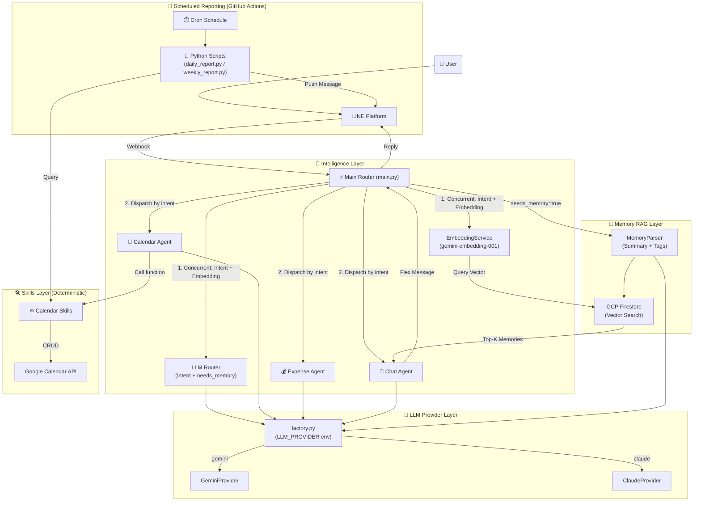

# 🤖 AI Butler - Personal Smart Assistant (Python Ver.)

A **Serverless** LINE AI Bot built with Python, supporting multiple AI model providers (**Google Gemini** and **Anthropic Claude**) that can be switched with a single environment variable.

This project adopts the **Router-Agent-Skill** architecture pattern, separating "Intent Classification", "Parameter Parsing", and "Execution Logic" to achieve high stability and scalability.

## ✨ Core Features

- **🧠 Learning Memory System (RAG)**: Built-in **GCP Firestore Native Vector Search**.
  - Drop in technical notes, personal preferences, debugging logs — the AI auto-summarizes, tags, and vectorizes them.
  - During chat, relevant memories are retrieved via semantic search + **time-decay weighting** and injected as context (RAG).
  - Supported memory types: `technical_log` / `personal_fact` / `task_note` / `daily_log`.
- **⚡ Native Async Architecture**: Fully `async/await` from end to end. Intent classification and embedding run concurrently, eliminating Cold Start delays in Serverless environments.
- **🔌 Swappable AI Provider**: Switch between Gemini and Claude via `LLM_PROVIDER` — **zero code changes required**.
- **Ultra-Fast Intent Routing**: Uses lightweight models (Flash/Haiku) for sub-0.5s routing latency.
- **Atomic Skills**: Business logic is encapsulated in pure Python functions, ensuring 100% execution accuracy (no AI-generated code at runtime).
- **📅 Natural Language Calendar Management**:
  - **Create**: "Dinner with Sam tomorrow at 7 PM."
  - **Query**: "What's on my schedule next week?"
  - **Smart Reschedule**: "Delay tomorrow's meeting by 1 hour." (Auto-executes: Search → Delete Old → Create New).
  - **Fuzzy Delete**: "Cancel the gym session tonight."
  - **Batch Create**: "Meeting every Wednesday at 10 AM." (Auto-expands to specific dates for the next 4 weeks).
- **🔔 Automated Reports**:
  - **Daily Report**: Sent at **21:00** every night, summarizing tomorrow's schedule.
  - **Weekly Report**: Sent every **Sunday**, summarizing the next 7 days.
  - Powered by **GitHub Actions** (Serverless Cron Jobs).
- **👥 Group Chat Support**: Works in group chats! Wake it up using the trigger word **"Butler"** or **"管家"**.
- **Robustness**: Built-in argument normalization layer to automatically fix AI hallucinations.
- **Serverless**: Deployed on **Google Cloud Functions (Gen 2)**. Pay-as-you-go.

## 🛠️ Tech Stack

| Category | Technology |
|---|---|
| **Language** | Python 3.11 |
| **Cloud** | Google Cloud Functions Gen 2 (Cloud Run) |
| **AI Providers** | Google Gemini (via `google-genai` SDK) / Anthropic Claude (switchable) |
| **Memory / Vectors** | GCP Firestore Native Vector Search + `gemini-embedding-001` |
| **Messaging** | LINE Messaging API (SDK v3) |
| **CI/CD** | GitHub Actions (Scheduled Cron Jobs) |
| **Pattern** | Router-Agent-Skill Architecture |

## 🏗️ Architecture


```mermaid
graph TD
    User("👤 User") --> Line["LINE Platform"]
    Line --Webhook--> Gateway["⚡ Main Router (main.py)"]

    subgraph "🧠 Intelligence Layer"
        Gateway --"1. Concurrent: Intent + Embedding"--> RouterLLM["LLM Router\n(Intent + needs_memory)"]
        Gateway --"1. Concurrent: Intent + Embedding"--> Embed["EmbeddingService\n(gemini-embedding-001)"]
        Gateway --"2. Dispatch by intent"--> CalAgent["📅 Calendar Agent"]
        Gateway --"2. Dispatch by intent"--> ExpAgent["💰 Expense Agent"]
        Gateway --"2. Dispatch by intent"--> ChatAgent["💬 Chat Agent"]
    end

    subgraph "🧠 Memory RAG Layer"
        Embed --"Query Vector"--> Firestore["GCP Firestore\n(Vector Search)"]
        Firestore --"Top-K Memories"--> ChatAgent
        Gateway --"needs_memory=true"--> MemParser["MemoryParser\n(Summary + Tags)"]
        MemParser --> Firestore
    end

    subgraph "🔌 LLM Provider Layer"
        RouterLLM & CalAgent & ExpAgent & ChatAgent & MemParser --> Factory["factory.py\n(LLM_PROVIDER env)"]
        Factory -->|gemini| Gemini["GeminiProvider"]
        Factory -->|claude| Claude["ClaudeProvider"]
    end

    subgraph "🛠️ Skills Layer (Deterministic)"
        CalAgent --"Call function"--> Skill["⚙️ Calendar Skills"]
        Skill --"CRUD"--> GCal["Google Calendar API"]
    end

    subgraph "🔔 Scheduled Reporting (GitHub Actions)"
        Cron["⏱️ Cron Schedule"] --> Scripts["🐍 Python Scripts\n(daily_report.py / weekly_report.py)"]
        Scripts --"Query"--> Skill
        Scripts --"Push Message"--> Line
    end

    ChatAgent --"Flex Message"--> Gateway
    Gateway --"Reply"--> Line
```

## 📂 Project Structure

```text
.
├── main.py                     # Gateway: intent routing, concurrent embedding, memory trigger
├── .github/
│   └── workflows/              # GitHub Actions
│       ├── daily_notify.yml    # Daily schedule cron
│       └── weekly_notify.yml   # Weekly schedule cron
├── src/
│   ├── agents/                 # Agents (AI Parsers & Controllers)
│   │   ├── calendar.py         # Calendar intent parsing
│   │   ├── expense.py          # Expense tracking intent parsing
│   │   ├── chat.py             # Chat Agent (with memory context injection)
│   │   └── memory_parser.py    # ✨ Memory summary & tag extraction Agent
│   ├── skills/                 # Skills (Pure Python Logic)
│   │   ├── calendar_skill.py   # Google Calendar CRUD operations
│   │   └── expense_skill.py    # Google Sheets expense logging
│   ├── scripts/                # Standalone scripts for scheduled reports
│   │   ├── daily_report.py
│   │   └── weekly_report.py
│   ├── services/               # Drivers & Adapters
│   │   ├── gcal_service.py     # Google Calendar API integration
│   │   ├── firestore_service.py # ✨ Firestore Vector Search (memory store)
│   │   └── llm/                # LLM Abstraction Layer (extensible)
│   │       ├── base.py         # LLMProvider abstract interface (async)
│   │       ├── gemini.py       # Gemini adapter (google-genai SDK)
│   │       ├── claude.py       # Claude adapter (AsyncAnthropic)
│   │       ├── embedding.py    # ✨ Embedding Service (fixed Gemini)
│   │       └── factory.py      # Provider factory function
│   ├── prompts/                # AI System Prompts
│   │   ├── system_prompt.txt   # Router prompt (includes needs_memory flag)
│   │   └── chat_agent.txt      # Chat Agent prompt (memory injection template)
│   ├── config.py               # Centralized configuration (model names, params)
│   └── utils/                  # Helpers & UI (Flex Messages)
└── requirements.txt
```

## 🚀 Quick Start

### 1. Prerequisites

- Python 3.11+
- Google Cloud Platform account with the following APIs enabled:
  - **Cloud Functions** / **Cloud Run**
  - **Cloud Build**
  - **Google Calendar API**
  - **Firestore** (Native Mode — requires a manual vector index on the `memories` collection; see below)
- **Service Account**: Create a GCP Service Account, download the JSON key, and grant it Calendar read/write and Firestore read/write permissions.
- LINE Developers Channel (Messaging API)
- **Gemini API Key** (`GEMINI_API_KEY`) — Required regardless of which `LLM_PROVIDER` you use, because the Embedding service always uses Gemini to maintain vector space consistency.

### 2. Installation

```bash
python3 -m venv venv
source venv/bin/activate
pip install -r requirements.txt
```

### 3. Environment Variables

Create a `.env` file in the project root:

```ini
# LINE Bot
CHANNEL_ACCESS_TOKEN=your_line_token
CHANNEL_SECRET=your_line_secret

# Google
CALENDAR_ID=your_google_calendar_id

# AI Provider (GEMINI_API_KEY is always required)
LLM_PROVIDER=gemini          # or: claude
GEMINI_API_KEY=your_gemini_key
# ANTHROPIC_API_KEY=your_claude_key
```

### 4. Firestore Vector Index Setup

The memory system uses GCP Firestore Native Vector Search. Before first use, create a Composite Index in GCP Console:

- **Collection**: `memories`
- **Field**: `embedding` (Vector, dimension: `768`, distance: `COSINE`)
- **Field**: `user_id` (Ascending)

> 💡 After deploying, send your first message. The Cloud Functions log will display an official "Create Index" shortcut link — click it to jump directly to the Console.

### 5. Local Development & Deployment

**Local Testing:**

```bash
functions-framework --target=webhook --debug
```

> ⚠️ Local testing requires a valid `service-account.json` in the root directory with appropriate GCP permissions.

**Deploy to GCP (minimum 512MiB recommended):**

```bash
gcloud functions deploy line-bot-function \
  --gen2 \
  --runtime=python311 \
  --region=asia-east1 \
  --memory=512MiB \
  --source=. \
  --entry-point=webhook \
  --trigger-http \
  --allow-unauthenticated \
  --set-env-vars="CHANNEL_ACCESS_TOKEN=...,CHANNEL_SECRET=...,LLM_PROVIDER=gemini,GEMINI_API_KEY=...,CALENDAR_ID=..."
```

### 6. Setting Up Scheduled Reports (GitHub Actions)

To enable daily/weekly reports, configure the following GitHub Secrets (Settings > Secrets and variables > Actions):

- **CHANNEL_ACCESS_TOKEN**: Your LINE Channel Access Token.
- **CALENDAR_ID**: Your Google Calendar ID.
- **TARGET_GROUP_ID**: The LINE Group ID (starts with `C`) or User ID (starts with `U`) where reports will be sent.
- **GCP_SA_KEY_BASE64**: Your GCP Service Account JSON encoded in Base64.
  - Command to generate: `base64 -i service_account.json -o sa_base64.txt` (copy the file content).

💡 **Tip: How to get the correct Group ID?** The ID shown in the LINE OA Manager URL is **not** the API Group ID.

  1. Invite the bot to a group.
  2. Send a message in the group, then check GCP Logs for `source.groupId`.

## 🔌 Switching AI Providers

Switch between Gemini and Claude **with zero code changes** — just update your `.env`:

| `LLM_PROVIDER` | Required API Key | Router Model | Agent Model |
|---|---|---|---|
| `gemini` (default) | `GEMINI_API_KEY` | `gemini-3-flash-preview` | `gemini-3-flash-preview` |
| `claude` | `ANTHROPIC_API_KEY` | `claude-haiku-4-5` | `claude-sonnet-4-5` |

> 📌 **Note**: `GEMINI_API_KEY` is **always required** regardless of provider, because the memory embedding pipeline is fixed to `gemini-embedding-001` to ensure vector space consistency.

> Model names can be customized in `src/config.py`.

## 📝 Usage Examples

**Calendar Management:**
- **Add Event**: "Butler, take my son to get vaccinated tomorrow at 3 PM"
- **Query Schedule**: "Butler, what's on the schedule this week?"
- **Batch Create**: "Butler, 12/19 (Fri) 09:00-10:00, 12/26 (Fri) 09:00-10:00, English Conversation Class"

**Memory System:**
- **Log a technical note**: "Today I debugged an FD leak — root cause was the eventlet hub not being closed correctly in an asyncio environment."
- **Log a personal fact**: "I'm allergic to shellfish, keep this in mind when recommending restaurants."
- **Automatic recall**: In future conversations, the butler will proactively reference relevant memories.

## 👤 Author

Developed by [YenCheng Lai](https://github.com/YenChengLai)

## 📄 License

MIT License
