# 🤖 AI Butler - Personal Smart Assistant (Python Ver.)

A Serverless LINE AI Bot built with Python, powered by **Google Gemini 3.0 Flash**.

This project adopts the **Router-Agent-Skill** architecture pattern, separating "Intent Classification", "Parameter Parsing", and "Execution Logic" to achieve high stability and scalability.

## ✨ Core Features

- **Ultra-Fast Intent Routing**: Powered by Gemini 3.0 Flash Preview, creating a sub-0.5s latency router.
- **Atomic Skills**: Business logic is encapsulated in pure Python functions, ensuring 100% execution accuracy (no dependency on AI-generated code).
- **Natural Language Calendar Management**:
  - **Create**: "Dinner with Sam tomorrow at 7 PM."
  - **Query**: "What's on my schedule next week?"
  - **Smart Reschedule**: "Delay tomorrow's meeting by 1 hour." (Auto-executes: Search -> Delete Old -> Create New).
  - **Fuzzy Delete**: "Cancel the gym session tonight."
  - **Batch Create**: "Meeting every Wednesday at 10 AM." (Auto-expands to specific dates for the next 4 weeks).
- **Robustness**: Built-in argument normalization layer to automatically fix AI hallucinations (e.g., `summary` vs `title`).
- **Serverless**: Deployed on Google Cloud Functions (Gen 2). Pay-as-you-go.

## 🛠️ Tech Stack

- **Language**: Python 3.11
- **Cloud**: Google Cloud Platform (Cloud Functions Gen 2)
- **AI Model**: Google Gemini 3.0 Flash (Preview)
- **Messaging**: LINE Messaging API (SDK v3)
- **Pattern**: Router-Agent-Skill Architecture

## 🏗️ Architecture

```mermaid
graph TD
    User("👤 User") --> Line["LINE Platform"]
    Line --Webhook--> Gateway["⚡ Main Router (Gateway)"]

    subgraph "🧠 Intelligence Layer"
        Gateway --"1. Classify Intent"--> RouterModel["Gemini (Router Prompt)"]
        Gateway --"2. Dispatch"--> CalAgent["📅 Calendar Agent"]
        CalAgent --"3. Parse Args"--> AgentModel["Gemini (Parser Prompt)"]
    end

    subgraph "🛠️ Skills Layer (Deterministic)"
        CalAgent --"4. Call Function"--> Skill["⚙️ Calendar Skills"]
        Skill --"CRUD"--> GCal["Google Calendar API"]
    end

    Skill --"Result"--> CalAgent
    CalAgent --"Flex Message"--> Gateway
    Gateway --"Reply"--> Line
```



## 📂 Project Structure

```text
.
├── main.py                     # Gateway (Router) - Only responsible for intent classification
├── src/
│   ├── agents/                 # Agents (AI Parsers & Controllers)
│   │   └── calendar.py         # Responsible for reading Prompt, cleaning parameters, calling Skill
│   ├── skills/                 # Skills (Pure Python Logic)
│   │   └── calendar.py         # Atomic tools (Create, Delete, Reschedule)
│   ├── services/               # Drivers
│   │   └── gcal_service.py     # Bottom-level API integration
│   ├── prompts/                # AI System Prompts
│   │   ├── system_prompt.txt   # Router Prompt
│   │   └── calendar_agent.txt  # Calendar Parser Prompt
│   └── utils/                  # Helpers & UI
└── requirements.txt
```

## 🚀 Quick Start

1. **Prerequisites**

- Python 3.11+
- Google Cloud Platform account (enable Cloud Functions, Cloud Build, Calendar API)
- LINE Developers Channel (Messaging API)
- Google AI Studio API Key (Gemini)

2. **Installation**

   ```bash
   python3 -m venv venv
   source venv/bin/activate
   pip install -r requirements.txt
   ```

3. **Environment Variables**

   Please create a `.env` file in the root directory:

   ```ini
   CHANNEL_ACCESS_TOKEN=your_line_token
   CHANNEL_SECRET=your_line_secret
   GEMINI_API_KEY=your_gemini_key
   CALENDAR_ID=your_gmail@gmail.com
   ```

4. **Local Development & Deployment**

   **Local Testing:**

   ```bash
   functions-framework --target=webhook --debug
   ```

   **Deployment to GCP:**

   ```bash
   gcloud functions deploy line-bot-function \
   --gen2 \
   --runtime=python311 \
   --region=asia-east1 \
   --source=. \
   --entry-point=webhook \
   --trigger-http \
   --allow-unauthenticated \
   --set-env-vars="CHANNEL_ACCESS_TOKEN=...,CHANNEL_SECRET=...,GEMINI_API_KEY=...,CALENDAR_ID=..."
   ```

5. **Usage Examples**

- **Add Event**: "Butler, take my son to get vaccinated tomorrow at 3 PM"
- **Query Schedule**: "Butler, what's on the schedule this week?"
- **Batch Create Events**:

  > User: "Butler, 12/19 (Fri) 09:00-10:00, 12/26 (Fri) 09:00-10:00, English Conversation Class"
  >
  > Bot: (automatically creates two events titled "English Conversation Class")

## 👤 Author

Developed by [YenCheng Lai](https://github.com/YenChengLai)

## 📄 License

MIT License
