# 🤖 AI Butler - Personal Smart Assistant (Python Ver.)

A Serverless LINE AI Bot built with Python, powered by **Google Gemini 3.0 Flash** as its core brain. It aims to provide efficient personal assistant services at extremely low cost (near free).

## ✨ Core Features

- **Ultra-Fast Intent Routing**: Powered by Gemini 3.0 Flash Preview, achieving intent detection latency under 0.5s.
- **Natural Language Calendar**:
  - Query: "What's on my schedule next week?"
  - Create: "Dinner with Sam tomorrow at 7 PM."
  - Batch Create: "Meeting on Monday morning, Gym on Wednesday afternoon."
- **Serverless Architecture**: Deployed on Google Cloud Functions (Gen 2). No server management required. Pay-as-you-go (usually free for personal use).
- **Modular Design**: Adopts an Agent pattern, making it easy to extend new features (e.g., Expense tracking, To-Do lists).

## 🛠️ Tech Stack

- **Language**: Python 3.11
- **Cloud Platform**: Google Cloud Platform (Cloud Functions Gen 2)
- **AI Model**: Google Gemini 3.0 Flash (Preview)
- **Messaging Platform**: LINE Messaging API (SDK v3)
- **Database/API**: Google Calendar API, (Google Sheets integration coming soon)

## 🏗️ System Architecture

```mermaid
graph TD
    User("👤 User") --> Line["LINE Platform"]
    Line --Webhook--> Gateway["⚡ Cloud Function (Gateway)"]

    subgraph "🧠 AI Processing"
        Gateway --"1. Intent (Router)"--> Gemini["✨ Gemini 3.0 Flash"]
    end

    subgraph "🤖 Agents & Services"
        Gateway --"Action: Calendar"--> CalAgent["📅 Calendar Agent"]
        CalAgent --"API CRUD"--> GCal["Google Calendar"]
    end

    CalAgent --"Flex Message"--> Gateway
    Gateway --"Reply"--> Line
```



## 🚀 Quick Start

1. **Prerequisites**

- Python 3.11+
- Google Cloud Platform account (enable Cloud Functions, Cloud Build, Calendar API)
- LINE Developers Channel (Messaging API)
- Google AI Studio API Key (Gemini)

2. **Installation**

   ```bash
   python3 -m venv venv
   source venv/bin/activate
   pip install -r requirements.txt
   ```

3. **Environment Variables**

   Please create a `.env` file in the root directory:

   ```ini
   CHANNEL_ACCESS_TOKEN=your_line_token
   CHANNEL_SECRET=your_line_secret
   GEMINI_API_KEY=your_gemini_key
   CALENDAR_ID=your_gmail@gmail.com
   ```

4. **Local Development & Deployment**

   **Local Testing:**

   ```bash
   functions-framework --target=webhook --debug
   ```

   **Deployment to GCP:**

   ```bash
   gcloud functions deploy line-bot-function \
   --gen2 \
   --runtime=python311 \
   --region=asia-east1 \
   --source=. \
   --entry-point=webhook \
   --trigger-http \
   --allow-unauthenticated \
   --set-env-vars="CHANNEL_ACCESS_TOKEN=...,CHANNEL_SECRET=...,GEMINI_API_KEY=...,CALENDAR_ID=..."
   ```

5. **Usage Examples**

- **Add Event**: "Butler, take my son to get vaccinated tomorrow at 3 PM"
- **Query Schedule**: "Butler, what's on the schedule this week?"
- **Batch Create Events**:

  > User: "Butler, 12/19 (Fri) 09:00-10:00, 12/26 (Fri) 09:00-10:00, English Conversation Class"
  >
  > Bot: (automatically creates two events titled "English Conversation Class")

## 👤 Author

Developed by [YenCheng Lai](https://github.com/YenChengLai)

## 📄 License

MIT License
