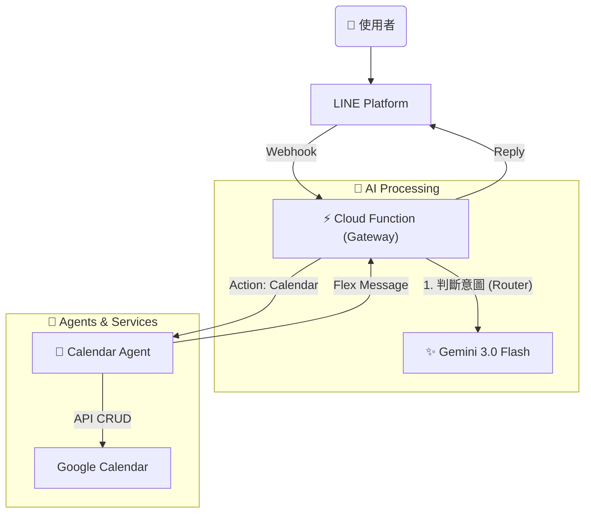

# 🤖 AI Butler - 個人智慧管家 (Python Ver.)

這是一個基於 **Serverless 架構** 的 LINE AI 機器人，核心使用 Python 開發，並採用 **Google Gemini 3.0 Flash** 作為大腦。它旨在以極低的成本（接近免費），提供高效的個人助理服務。

## ✨ 核心特色

- **極速意圖判斷**：使用 Gemini 3.0 Flash Preview，路由判斷延遲低於 0.5 秒。
- **自然語言行事曆**：
  - 查詢：「下週有什麼行程？」
  - 建立：「明天晚上七點跟小明吃飯。」
  - 批次建立：「週一早上開會、週三下午去健身。」
- **無伺服器架構**：部署於 Google Cloud Functions (Gen 2)，無須管理伺服器，按用量計費（個人使用通常免費）。
- **模組化設計**：採用 Agent 模式，易於擴充新功能（如：記帳、待辦事項）。

## 🛠️ 技術棧

- **語言**：Python 3.11
- **雲端平台**：Google Cloud Platform (Cloud Functions Gen 2)
- **AI 模型**：Google Gemini 3.0 Flash (Preview)
- **訊息平台**：LINE Messaging API (SDK v3)
- **資料庫/API**：Google Calendar API, (未來整合 Google Sheets)

## 🏗️ 系統架構



## 🚀 快速開始 (Quick Start)

1. **環境準備**

- Python 3.11+
- Google Cloud Platform 帳號 (啟用 Cloud Functions, Cloud Build, Calendar API)
- LINE Developers Channel (Messaging API)
- Google AI Studio API Key (Gemini)

2. **安裝依賴**

   ```bash
   python3 -m venv venv
   source venv/bin/activate
   pip install -r requirements.txt
   ```

3. **環境變數設定 (.env)**

   請在根目錄建立 `.env` 檔案：

   ```ini, TOML
   CHANNEL_ACCESS_TOKEN=你的_LINE_Token
   CHANNEL_SECRET=你的_LINE_Secret
   GEMINI_API_KEY=你的_Gemini_Key
   CALENDAR_ID=你的_Gmail@gmail.com
   ```

4. **本地開發與部署**

   **本地測試:**

   ```bash
   functions-framework --target=webhook --debug
   ```

   **部署至 GCP:**

   ```bash
   gcloud functions deploy line-bot-function \
   --gen2 \
   --runtime=python311 \
   --region=asia-east1 \
   --source=. \
   --entry-point=webhook \
   --trigger-http \
   --allow-unauthenticated \
   --set-env-vars="CHANNEL_ACCESS_TOKEN=...,CHANNEL_SECRET=...,GEMINI_API_KEY=...,CALENDAR_ID=..."
   ```

## 📝 使用範例

- **新增行程**: 「管家，明天下午三點要帶兒子去打疫苗」
- **查詢行程**: 「管家，這禮拜有什麼行程?」
- **批量建立**:

  > User: 「管家，12/19（五）09:00-10:00、12/26（五）09:00-10:00，上英文會話」
  >
  > Bot: (自動建立兩筆標題為「上英文會話」的行程)

## 👤 Author

Developed by [YenCheng Lai](https://github.com/YenChengLai)

## 📄 License

MIT License
