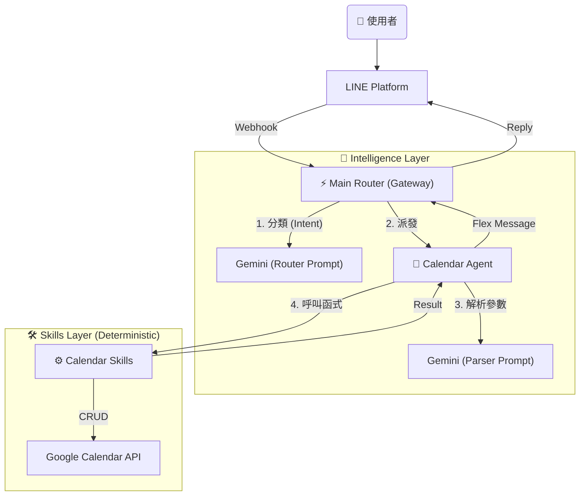

# 🤖 AI Butler - 個人智慧管家 (Python Ver.)

這是一個基於 **Serverless 架構** 的 LINE AI 機器人，核心使用 Python 開發，並採用 **Google Gemini 3.0 Flash** 作為大腦。

本專案採用 **Router-Agent-Skill** 架構模式，將「意圖判斷」、「參數解析」與「執行邏輯」分離，實現極高的穩定性與擴充性。

## ✨ 核心特色

- **極速意圖判斷 (Router)**：使用 Gemini 3.0 Flash Preview，路由判斷延遲低於 0.5 秒。
- **原子化技能 (Atomic Skills)**：將商業邏輯封裝為純 Python 函式，確保執行結果 100% 準確（不依賴 AI 寫程式）。
- **自然語言行事曆管理**：
  - **建立**: 「明天晚上七點跟小明吃飯」
  - **查詢**: 「下週有什麼行程？」
  - **智慧改期 (Reschedule)**: 「把明天的會議延後一小時」（自動執行：搜尋 -> 刪除舊行程 -> 建立新行程）。
  - **模糊刪除 (Fuzzy Delete)**: 「取消晚上的健身課」。
  - **批量建立**: 「每週三早上 10 點開會」（自動展開未來 4 週行程）。
- **容錯機制 (Robustness)**：內建參數清洗層，自動修正 AI 產生的幻覺參數 (如 `summary` vs `title`)。
- **無伺服器架構**：部署於 Google Cloud Functions (Gen 2)，按用量計費（個人使用通常免費）。

## 🛠️ 技術棧

- **語言**：Python 3.11
- **雲端平台**：Google Cloud Platform (Cloud Functions Gen 2)
- **AI 模型**：Google Gemini 3.0 Flash (Preview)
- **訊息平台**：LINE Messaging API (SDK v3)
- **設計模式**：Router-Agent-Skill Pattern

## 🏗️ 系統架構



## 📂 專案結構

```text
.
├── main.py                     # Gateway (Router) - 只負責意圖分類
├── src/
│   ├── agents/                 # Agents (AI Parsers & Controllers)
│   │   └── calendar.py         # 負責讀取 Prompt、清洗參數、呼叫 Skill
│   ├── skills/                 # Skills (Pure Python Logic)
│   │   └── calendar.py         # 原子化工具 (Create, Delete, Reschedule)
│   ├── services/               # Drivers
│   │   └── gcal_service.py     # Google API 底層串接
│   ├── prompts/                # AI System Prompts
│   │   ├── system_prompt.txt   # Router 用
│   │   └── calendar_agent.txt  # Calendar Parser 用
│   └── utils/                  # Helpers & UI
└── requirements.txt
```

## 🚀 快速開始 (Quick Start)

1. **環境準備**

- Python 3.11+
- Google Cloud Platform 帳號 (啟用 Cloud Functions, Cloud Build, Calendar API)
- LINE Developers Channel (Messaging API)
- Google AI Studio API Key (Gemini)

2. **安裝依賴**

   ```bash
   python3 -m venv venv
   source venv/bin/activate
   pip install -r requirements.txt
   ```

3. **環境變數設定 (.env)**

   請在根目錄建立 `.env` 檔案：

   ```ini, TOML
   CHANNEL_ACCESS_TOKEN=你的_LINE_Token
   CHANNEL_SECRET=你的_LINE_Secret
   GEMINI_API_KEY=你的_Gemini_Key
   CALENDAR_ID=你的_Gmail@gmail.com
   ```

4. **本地開發與部署**

   **本地測試:**

   ```bash
   functions-framework --target=webhook --debug
   ```

   **部署至 GCP:**

   ```bash
   gcloud functions deploy line-bot-function \
   --gen2 \
   --runtime=python311 \
   --region=asia-east1 \
   --source=. \
   --entry-point=webhook \
   --trigger-http \
   --allow-unauthenticated \
   --set-env-vars="CHANNEL_ACCESS_TOKEN=...,CHANNEL_SECRET=...,GEMINI_API_KEY=...,CALENDAR_ID=..."
   ```

## 📝 使用範例

- **新增行程**: 「管家，明天下午三點要帶兒子去打疫苗」
- **查詢行程**: 「管家，這禮拜有什麼行程?」
- **批量建立**:

  > User: 「管家，12/19（五）09:00-10:00、12/26（五）09:00-10:00，上英文會話」
  >
  > Bot: (自動建立兩筆標題為「上英文會話」的行程)

## 👤 Author

Developed by [YenCheng Lai](https://github.com/YenChengLai)

## 📄 License

MIT License
