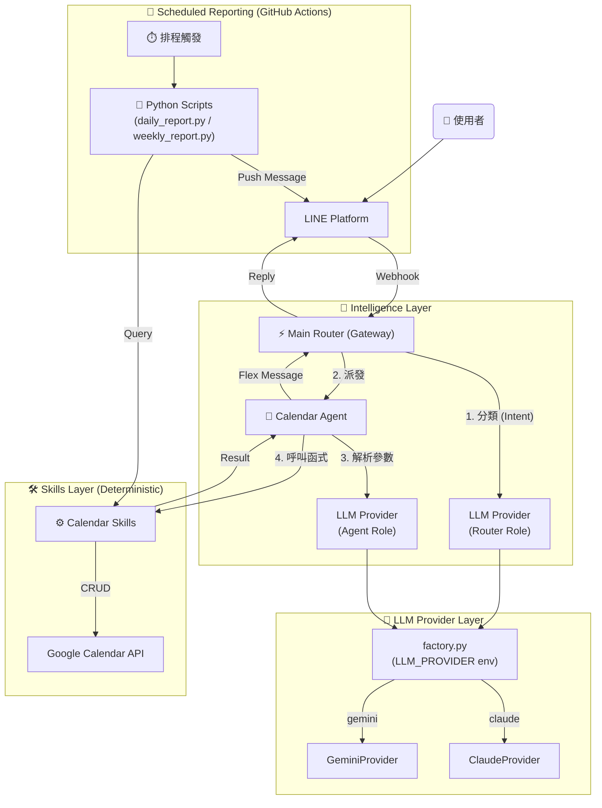

# 🤖 AI Butler - 個人智慧管家 (Python Ver.)

這是一個基於 **Serverless 架構** 的 LINE AI 機器人，核心使用 Python 開發，並支援多個 AI 模型 Provider（目前支援 **Google Gemini** 與 **Anthropic Claude**），可透過單一環境變數快速切換。

本專案採用 **Router-Agent-Skill** 架構模式，將「意圖判斷」、「參數解析」與「執行邏輯」分離，實現極高的穩定性與擴充性。

## ✨ 核心特色

- **極速意圖判斷 (Router)**：使用 Flash/Haiku 等輕量模型，路由判斷延遲低於 0.5 秒。
- **🧠 學習記憶系統 (Memory RAG)**：內建 Firestore Vector Search 組件，可自動濃縮並記憶技術文件、個人偏好，並透過時間半衰期 (Time-decay) 篩選背景知識注入聊天上下文。
- **⚡ 非同步高併發架構**：核心採用全面 Async/Await，並在 Module-level 啟動實例化，解決 Serverless Cold Start 痛點。
- **🔌 可替換 AI Provider**：透過 `LLM_PROVIDER` 一鍵切換 Gemini / Claude，不需修改任何業務邏輯。
- **原子化技能 (Atomic Skills)**：將商業邏輯封裝為純 Python 函式，確保執行結果 100% 準確（不依賴 AI 寫程式）。
- **自然語言行事曆管理**：
  - **建立**: 「明天晚上七點跟小明吃飯」
  - **查詢**: 「下週有什麼行程？」
  - **智慧改期 (Reschedule)**: 「把明天的會議延後一小時」（自動執行：搜尋 -> 刪除舊行程 -> 建立新行程）。
  - **模糊刪除 (Fuzzy Delete)**: 「取消晚上的健身課」。
  - **批量建立**: 「每週三早上 10 點開會」（自動展開未來 4 週行程）。
- **🔔 自動化行程報告**：
  - **每日日報**：每晚 **21:00** 自動發送明天的行程預告。
  - **每週週報**：每週 **週日** 自動發送未來七天的行程總覽。
  - **Serverless Cron**：基於 **GitHub Actions** 運行，無需維護額外伺服器。
- **👥 支援群組對話**：機器人可加入群組協作！請使用關鍵字 **「管家」** 喚醒（例如：「管家，幫我查行程」）。
- **容錯機制 (Robustness)**：內建參數清洗層，自動修正 AI 產生的幻覺參數。
- **無伺服器架構**：部署於 Google Cloud Functions (Gen 2)，按用量計費。

## 🛠️ 技術棧

- **語言**：Python 3.11
- **雲端平台**：Google Cloud Platform (Cloud Functions Gen 2, Cloud Run)
- **AI Provider**：Google Gemini 3.0 Flash / Anthropic Claude（可切換）
- **訊息平台**：LINE Messaging API (SDK v3)
- **CI/CD**：GitHub Actions (排程與自動化)
- **設計模式**：Router-Agent-Skill Pattern

## 🏗️ 系統架構


```mermaid
graph TD
    User("👤 使用者") --> Line["LINE Platform"]
    Line --Webhook--> Gateway["⚡ Main Router (Gateway)"]

    subgraph "🧠 Intelligence Layer"
        Gateway --"1. 分類 (Intent)"--> RouterLLM["LLM Provider\n(Router Role)"]
        Gateway --"2. 派發"--> CalAgent["📅 Calendar Agent"]
        CalAgent --"3. 解析參數"--> AgentLLM["LLM Provider\n(Agent Role)"]
    end

    subgraph "🔌 LLM Provider Layer"
        RouterLLM & AgentLLM --> Factory["factory.py\n(LLM_PROVIDER env)"]
        Factory -->|gemini| Gemini["GeminiProvider"]
        Factory -->|claude| Claude["ClaudeProvider"]
    end

    subgraph "🛠️ Skills Layer (Deterministic)"
        CalAgent --"4. 呼叫函式"--> Skill["⚙️ Calendar Skills"]
        Skill --"CRUD"--> GCal["Google Calendar API"]
    end

    subgraph "🔔 Scheduled Reporting (GitHub Actions)"
        Cron["⏱️ 排程觸發"] --> Scripts["🐍 Python Scripts\n(daily_report.py / weekly_report.py)"]
        Scripts --"Query"--> Skill
        Scripts --"Push Message"--> Line
    end

    Skill --"Result"--> CalAgent
    CalAgent --"Flex Message"--> Gateway
    Gateway --"Reply"--> Line
```

## 📂 專案結構

```text
.
├── main.py                     # Gateway (Router) - 只負責意圖分類
├── .github/
│   └── workflows/              # GitHub Actions (自動化排程設定)
│       ├── daily_notify.yml    # 每日日報 Cron Job
│       └── weekly_notify.yml   # 每週週報 Cron Job
├── src/
│   ├── agents/                 # Agents (AI Parsers & Controllers)
│   │   ├── calendar.py
│   │   └── expense.py
│   ├── skills/                 # Skills (Pure Python Logic)
│   │   ├── calendar_skill.py
│   │   └── expense.py
│   ├── scripts/                # Standalone Scripts (報表用腳本)
│   │   ├── daily_report.py
│   │   └── weekly_report.py
│   ├── services/               # Drivers & Adapters
│   │   ├── gcal_service.py     # Google Calendar API 底層串接
│   │   └── llm/                # ✨ LLM 抽象層 (可擴充新模型)
│   │       ├── base.py         # LLMProvider 抽象介面
│   │       ├── gemini.py       # Gemini 適配器
│   │       ├── claude.py       # Claude 適配器
│   │       └── factory.py      # Provider 工廠函式
│   ├── prompts/                # AI System Prompts
│   ├── config.py               # 統一設定管理
│   └── utils/                  # Helpers & UI (Flex Messages)
└── requirements.txt
```

## 🚀 快速開始 (Quick Start)

1. **環境準備**

- Python 3.11+
- Google Cloud Platform 帳號 (啟用 Cloud Functions, Cloud Build, Calendar API)
- **Service Account**: 建立一個 GCP 服務帳號，下載 JSON 金鑰，並授予其對日曆的讀寫權限。
- LINE Developers Channel (Messaging API)
- AI Provider API Key：**Gemini** (`GEMINI_API_KEY`) 或 **Claude** (`ANTHROPIC_API_KEY`)

2. **安裝依賴**

   ```bash
   python3 -m venv venv
   source venv/bin/activate
   pip install -r requirements.txt
   ```

3. **環境變數設定 (.env)**

   請在根目錄建立 `.env` 檔案：

   ```ini
   # LINE Bot
   CHANNEL_ACCESS_TOKEN=你的_LINE_Token
   CHANNEL_SECRET=你的_LINE_Secret

   # Google
   CALENDAR_ID=你的_Gmail@gmail.com

   # AI Provider 設定 (二選一)
   LLM_PROVIDER=gemini          # 或 claude
   GEMINI_API_KEY=你的_Gemini_Key
   # ANTHROPIC_API_KEY=你的_Claude_Key
   ```

4. **本地開發與部署**

   **本地測試:**

   ```bash
   functions-framework --target=webhook --debug
   ```

   **部署至 GCP:**

   ```bash
   gcloud functions deploy line-bot-function \
   --gen2 \
   --runtime=python311 \
   --region=asia-east1 \
   --source=. \
   --entry-point=webhook \
   --trigger-http \
   --allow-unauthenticated \
   --set-env-vars="CHANNEL_ACCESS_TOKEN=...,CHANNEL_SECRET=...,LLM_PROVIDER=gemini,GEMINI_API_KEY=...,CALENDAR_ID=..."
   ```

5. **設定 GitHub Actions (自動報表用)**
   若要啟用每日/每週報表，請至 GitHub Repo 的 Settings > Secrets and variables > Actions 新增以下 Secrets：

- **CHANNEL_ACCESS_TOKEN**: LINE Channel Access Token
- **CALENDAR_ID**: 目標 Google Calendar ID
- **TARGET_GROUP_ID**: 接收報表的群組 ID (C...) 或使用者 ID (U...)
- **GCP_SA_KEY_BASE64**: 將 service_account.json 轉為 Base64 字串後填入。
  - 產生指令: `base64 -i service_account.json -o sa_base64.txt`（複製 txt 內容）

💡 **常見問題：如何取得正確的 Group ID？** LINE 官方帳號後台網址上的 ID 不是 API 用的 Group ID。

    1. 將機器人邀入群組。
    2. 在群組說話，前往 GCP Logs 查看該事件的 source.groupId。

## 🔌 切換 AI Provider

本專案支援在 Gemini 與 Claude 之間切換，**無需修改任何程式碼**，只需更改 `.env`：

| `LLM_PROVIDER` | 需要的 API Key | Router 模型 | Agent 模型 |
|---|---|---|---|
| `gemini`（預設）| `GEMINI_API_KEY` | `gemini-3-flash-preview` | `gemini-3-flash-preview` |
| `claude` | `ANTHROPIC_API_KEY` | `claude-haiku-4-5` | `claude-sonnet-4-5` |

> 模型名稱可在 `src/config.py` 中調整。

## 📝 使用範例

- **新增行程**: 「管家，明天下午三點要帶兒子去打疫苗」
- **查詢行程**: 「管家，這禮拜有什麼行程?」
- **批量建立**:

  > User: 「管家，12/19（五）09:00-10:00、12/26（五）09:00-10:00，上英文會話」
  >
  > Bot: (自動建立兩筆標題為「上英文會話」的行程)

## 👤 Author

Developed by [YenCheng Lai](https://github.com/YenChengLai)

## 📄 License

MIT License
